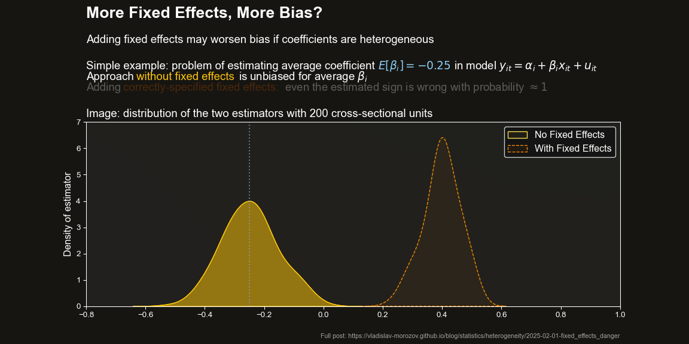

# Why Fixed Effects Are Not a Silver Bullet

This folder contains simulation codes showing how adding fixed effects may increase bias and lead to unreliable inference. 

## Overview, Blog Post, and a Visual Summary

Fixed effects are widely used to control for unobserved heterogeneity. 

However, adding fixed effects may lead to strongly biased estimates under realistic parameter heterogeneity. These biases appear even if the fixed effects are specified correctly.  

For the full story, simulation specification and results, theory, and solutions see the original blog post:

📖 [**Why Fixed Effects Are Not a Silver Bullet**](https://vladislav-morozov.github.io/blog/statistics/heterogeneity/2025-02-01-fixed_effects_danger/)

---
 
The simulation compares:
- **Pooled OLS estimator** (no fixed effects)
- **Fixed Effects estimator** (correctly-specified unit effects included)
 
The following image summarizes the main point of the simulation: adding fixed effects can lead to dramatic bias (even if the fixed effects are correctly specified!):
<figure>
  
  <figcaption>Graphical summary of results: adding fixed effects may lead to more biased estimates</figcaption>
</figure> 
  

## 📂 Project Structure
```
.
├── data_generation
│   ├── generate_data.py           # Data generation
│   ├── moment_conditions.py       # Defines moment conditions for estimation
│   ├── parameters.py              # Defines simulation parameters
├── gmm_solver
│   ├── solver.py                  # GMM solver implementation
├── simulation
│   ├── run_simulation.py          # Runs simulation for given seed
├── utils
│   ├── combine_results.py         # Combines simulation results
├── main.py                        # Main script to run simulations
└── README.md                      # This file
```

## ▶️ Usage

Run the simulation by executing:
```bash
python main.py
```


## 📤 Outputs
Results are saved in the `simulation_results/` directory:
- **`combined_results.csv`** → Aggregated simulation results.

 

## 🛠️ Requirements
- Python 3.12.8
- Key packages: `numpy`, `pandas`, `scipy`, `pyfixest` (see `requirements.txt` for full list).

 
 

## 📜 License
This project is licensed under the **MIT License**.
 
