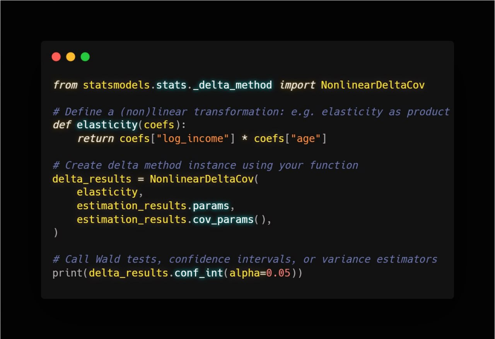

# The Hidden Delta Method in statsmodels (A Worked Example)

This folder contains Python codes with a worked example of using the delta method in `statsmodels`.

## Overview, Blog Post, and a Visual Summary

The delta method is a core tool in applied causal inference.

It is implemented in `statsmodels`, however the functionality was not documented. Accordingly, I decided to write a quick tutorial post.

This post walks through a worked example using that hidden functionality. It focuses on how to apply the delta method in practice with `statsmodels`: estimating nonlinear transformations, computing standard errors, building confidence intervals, and running Wald tests in a real setting.


📖 [**The Hidden Delta Method in statsmodels (A Worked Example)**](https://vladislav-morozov.github.io/blog/statistics/inference/2025-07-23-delta-method-statsmodels/)

---
 
<figure>
  
  <figcaption>The essential syntax</figcaption>
</figure> 
  


The example in the post estimates the relationship between wages and experience. The nonlinear parameter of interest is how many years you have to work to maximize your yearly earnings. 
  

## 📂 Project Structure
```
.
├── scripts
│   ├── data_preparation.py      
│   ├── delta_method_analysis.py    
├── main.py                        
└── README.md               
```

## ▶️ Usage

Run the simulation by executing:
```bash
python main.py
```


 

## 🛠️ Requirements

- Python 3.13.1
- Key packages: `numpy`, `pandas`, `statsmodels`(see `requirements.txt` for full list).

 
 

## 📜 License
This project is licensed under the **MIT License**.
 
