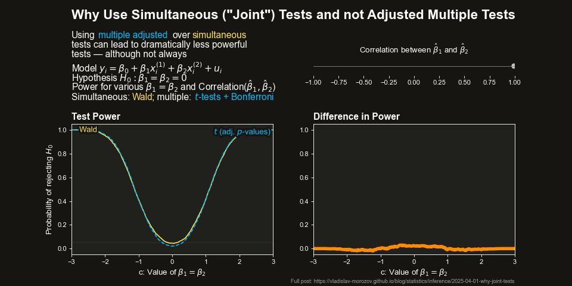

# Why Simultaneous (Joint) Tests Instead of Adjusted Multiple Tests?

This folder contains simulation codes on comparing the power properties of a simultaneous Wald test with an adjusted multiple $t$-test in linear regression.

## Overview, Blog Post, and a Visual Summary

When testing multiple hypotheses in a regression, why do we use simultaneous (joint) tests instead of just adjusting the $p$-values from separate $t$-tests?

The usual answer is a vague statement that simultaneous tests are more powerful. I never found specific numeric evidence to support this and decided to run a simulation and check it myself.

It turns out that the vague answer is right — but only mostly. For the full story, simulation specification, results, and some theory, see the original blog post:

📖 [**Why Simultaneous (Joint) Tests Instead of Adjusted Multiple Tests?**](https://vladislav-morozov.github.io/blog/statistics/inference/2025-04-01-why-joint-test/)

---
 
The simulation compares:
- A simultaneous ("joint") Wald test.
- A test based on multiple $t$-tests with suitably corrected critical values.
 
The following image summarizes the main point of the simulation: adjusted multiple testing can lead to a massive loss of power compared to simultaneous testing. However, in some cases simultaneous testing actually performs slightly worse.
<figure>
  
  <figcaption>Graphical summary of results: the upside of simultaneous tests is possibly much larger than the possible downsides</figcaption>
</figure> 
  

## 📂 Project Structure
```
.
├── data_generation
│   ├── generate_data.py           # Data generation 
│   ├── parameters.py              # Defines simulation parameters 
├── simulation
│   ├── run_simulation.py          # Runs simulation for given seed
├── utils
│   ├── combine_results.py         # Combines simulation results
├── main.py                        # Main script to run simulations
└── README.md                      # This file
```

## ▶️ Usage

Run the simulation by executing:
```bash
python main.py
```


## 📤 Outputs
Results are saved in the `simulation_results/` directory:
- **`combined_results.csv`** → Aggregated simulation results.

 

## 🛠️ Requirements
- Python 3.12.8
- Key packages: `numpy`, `pandas`, `statsmodels`(see `requirements.txt` for full list).

 
 

## 📜 License
This project is licensed under the **MIT License**.
 
